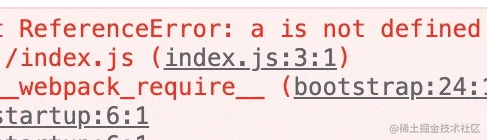
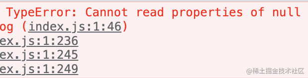

# Source map

## 背景
::: info 开发环境
当我们在开发环境下编写应用时，我们很容易就能找到问题点在哪，点击报错点就直接跳到了源码位置。
:::




::: info 生产环境
当我们在生产环境中遇到问题时，有时候很难找到问题所在。这是因为在生产环境中，代码通常会被压缩和混淆，使得它们难以阅读和理解。
:::




::: info  source map
这就需要使用 source map 来帮助我们。那么什么是source map?
:::

## SourceMap
Source map 可以将`压缩后的代码`映射回`原始源代码`。这样可以让我们更容易地进行调试并找到错误所在。好了还是上代码讲的更清楚：只需要在`webpack.config.js`里加上`devtool: "source-map"`


```js
// index.js
const { log } = require("./a");
log(null);

// a.js
const log = (str) => {
  const strr = str.split('');
  console.log(123,strr)
  return '';
}
exports.log = log;

//webpack.config.js
const path = require("path");
const HtmlWebpackPlugin = require('html-webpack-plugin');
const { CleanWebpackPlugin } = require('clean-webpack-plugin');

module.exports = {
  mode: "production",
  entry: "./index.js",
  devtool: "source-map",
  output: {
    filename: "index.js",
    path: path.resolve(__dirname, "sourcemap"),
  },
  plugins: [
    new HtmlWebpackPlugin(),
    new CleanWebpackPlugin(),
  ],
};
```

打包之后我们会发现：

打包目录 `sourcemap`下
1. 多了一个index.js.map文件。
2. index.js 文件最后一行多了 `//# sourceMappingURL=index.js.map`

## xxx.js.map
```js
{
  "version": 3,
  "file": "index.js",
  "mappings": "yBAKAA,EAAQC,IALKC,IACX,MAAMC,EAAOD,EAAIE,MAAM,IAEvB,OADAC,QAAQJ,IAAI,IAAIE,GACT,EAAE,C,GCFPG,EAA2B,CAAC,EAGhC,SAASC,EAAoBC,GAE5B,IAAIC,EAAeH,EAAyBE,GAC5C,QAAqBE,IAAjBD,EACH,OAAOA,EAAaT,QAGrB,IAAIW,EAASL,EAAyBE,GAAY,CAGjDR,QAAS,CAAC,GAOX,OAHAY,EAAoBJ,GAAUG,EAAQA,EAAOX,QAASO,GAG/CI,EAAOX,OACf,C,MCtBA,MAAM,IAAEC,GAAQ,EAAQ,KACxBA,EAAI,K",
  "sources": [
    "webpack:///./a.js",
    "webpack:///webpack/bootstrap",
    "webpack:///./index.js"
  ],
  "sourcesContent": [
    "const log = (str) => {\n  const strr = str.split('');\n  console.log(123,strr)\n  return '';\n}\nexports.log = log;",
    "// The module cache\nvar __webpack_module_cache__ = {};\n\n// The require function\nfunction __webpack_require__(moduleId) {\n\t// Check if module is in cache\n\tvar cachedModule = __webpack_module_cache__[moduleId];\n\tif (cachedModule !== undefined) {\n\t\treturn cachedModule.exports;\n\t}\n\t// Create a new module (and put it into the cache)\n\tvar module = __webpack_module_cache__[moduleId] = {\n\t\t// no module.id needed\n\t\t// no module.loaded needed\n\t\texports: {}\n\t};\n\n\t// Execute the module function\n\t__webpack_modules__[moduleId](module, module.exports, __webpack_require__);\n\n\t// Return the exports of the module\n\treturn module.exports;\n}\n\n",
    "const { log } = require(\"./a\");\nlog(null);\n"
  ],
  "names": [
    "exports",
    "log",
    "str",
    "strr",
    "split",
    "console",
    "__webpack_module_cache__",
    "__webpack_require__",
    "moduleId",
    "cachedModule",
    "undefined",
    "module",
    "__webpack_modules__"
  ],
  "sourceRoot": ""
}
```
文件主要包含以下内容：
- version: SourceMap的版本，如今最新版本为3
- file: 转换后的文件名
- mappings: 压缩混淆后的代码定位源代码的位置信息
- sources: 源文件列表
- sourcesContent: 源代码字符串列表，用于调试时展示源文件，列表每一项对应于sources
- names: 源文件中的变量名
- sourceRoot: 源文件根目录，这个值会加在每个源文件之前

## mappings
它分成三层：
- 第一层是**行对应**，以分号（;）表示，每个分号对应转换后源码的一行。所以，第一个分号前的内容，就对应源码的第一行，以此类推。
- 第二层是**位置对应**，以逗号（,）表示，每个逗号对应转换后源码的一个位置。所以，第一个逗号前的内容，就对应该行源码的第一个位置，以此类推。
- 第三层是**位置转换**，以<a ref="nofollow" href="http://en.wikipedia.org/wiki/Variable-length_quantity" target="_blank">VLQ编码</a>表示，代表该位置对应的转换前的源码位置。

## 位置对应的原理
从左边算起：
- 第一位，表示这个位置在（转换后的代码的）的第几列。
- 第二位，表示这个位置属于sources属性中的哪一个文件。
- 第三位，表示这个位置属于转换前代码的第几行。
- 第四位，表示这个位置属于转换前代码的第几列。
- 第五位，表示这个位置属于names属性中的哪一个变量。

**注意：**
- 所有的值都是以0作为基数的。
- 第五位不是必需的，如果该位置没有对应names属性中的变量，可以省略第五位
- 每一位都采用VLQ编码表示；由于VLQ编码是变长的，所以每一位可以由多个字符构成。

如果某个位置是AAAAA，由于A在VLQ编码中表示0，因此这个位置的五个位实际上都是0。它的意思是，该位置在转换后代码的第0列，对应sources属性中第0个文件，属于转换前代码的第0行第0列，对应names属性中的第0个变量。

这样我们可以通过index.map.js准确分析出打包后的index.js所对应的源码。

## 应用

可以借助`source-map`库来分析错误代码的位置，

1. 引入`source-map`
2. 读取错误文件的`js.map`,上图我们报错的是`index.js`所以引入`index.js.map`
3. 生成sourceMapConsumer
4. 然后借助api`originalPositionFor`,入参就是上图里的`行1 列46`，最终获取源代码里的行与列

```js
const fs = require('fs');

const sourceMap = require('source-map');

fs.readFile('./sourcemap/index.js.map', 'utf-8', function (err, data) {

  // 
  const consumer = new sourceMap.SourceMapConsumer(data);

  const sourceInfo = consumer.originalPositionFor({
    line: 1,
    column: 46
  })
  // error postion:  { source: 'webpack:///a.js', line: 2, column: 19, name: 'split' }
  console.log('error postion: ', sourceInfo)
})

```


