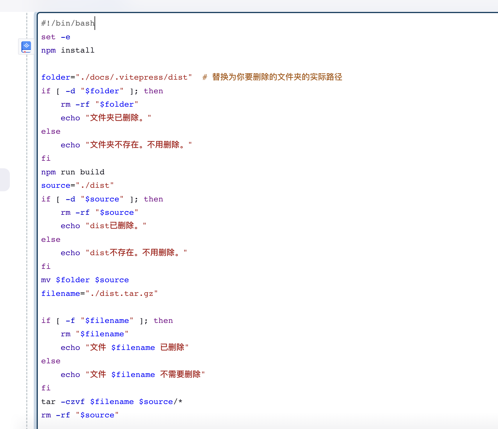

# Docker Jenkins 一步步教会你实现一键部署前端项目

<!-- ## 思路 -->
<!-- 我们使用Docker安装Jenkins，让Jenkins监控github(或者gitee)push，然后下拉代码、打包、压缩，然后把压缩包发到服务器，然后服务器里的nginx reload -->
## Docker安装以及Jenkins安装

[安装请移步这里](/deploy/jenkins)

## 基本设置

### Node

先在 Dashboard-系统管理-插件管理-Available plugins 下载node插件;
然后 Dashboard-系统管理-全局工具配置- nodejs安装，设置个node版本;


### Publish over SSH
Dashboard-系统管理-系统配置 


## 任务
### 创建任务，选择自由风格

### 源码管理,输入github ssh地址。

### 添加ssh凭证

#### 腾讯服务器终端输入`ssh-keygen -t rsa`


```
cat /.ssh/id_rsa // 作为key

```


#### github-右上角头像-设置
```
cat /.ssh/id_rsa.pub // 添加ssh
```


### 最后应该显示这样


### 构建触发器


### 构建环境
选择刚才添加的node环境


### shell脚本
这里打包出来的dist还只是在jenkins路径里，如果jenkins和服务器是不同的服务器，那么还需要使用publish over ssh将dist发送到服务器。


### 后续步骤
此时我们只是打完并压缩dist，然后我们需要发送包到服务器，选择图中的选项。


### 配置SSH Publishers


## 服务器nginx设置
### 第4行高亮处需要修改
``` nginx {4}
server
{
    listen 8081;
    server_name xx.xx.xx.xx; //腾讯服务器ip
    index index.php index.html index.htm default.php default.htm default.html;
    root /www/wwwroot/vitepress2/dist;

    #SSL-START SSL相关配置，请勿删除或修改下一行带注释的404规则
    #error_page 404/404.html;
    #SSL-END

    #ERROR-PAGE-START  错误页配置，可以注释、删除或修改
    #error_page 404 /404.html;
    #error_page 502 /502.html;
    #ERROR-PAGE-END

    #PHP-INFO-START  PHP引用配置，可以注释或修改
    include enable-php-74.conf;
    #PHP-INFO-END

    #REWRITE-START URL重写规则引用,修改后将导致面板设置的伪静态规则失效
    include /www/server/panel/vhost/rewrite/124.221.141.213.conf;
    #REWRITE-END

    #禁止访问的文件或目录
    location ~ ^/(\.user.ini|\.htaccess|\.git|\.env|\.svn|\.project|LICENSE|README.md)
    {
        return 404;
    }

    #一键申请SSL证书验证目录相关设置
    location ~ \.well-known{
        allow all;
    }

    #禁止在证书验证目录放入敏感文件
    if ( $uri ~ "^/\.well-known/.*\.(php|jsp|py|js|css|lua|ts|go|zip|tar\.gz|rar|7z|sql|bak)$" ) {
        return 403;
    }

    location ~ .*\.(gif|jpg|jpeg|png|bmp|swf)$
    {
        expires      30d;
        error_log /dev/null;
        access_log /dev/null;
    }

    location ~ .*\.(js|css)?$
    {
        expires      12h;
        error_log /dev/null;
        access_log /dev/null;
    }
    access_log  /www/wwwlogs/124.221.141.213.8080.log;
    error_log  /www/wwwlogs/124.221.141.213.8080.error.log;
}
```


