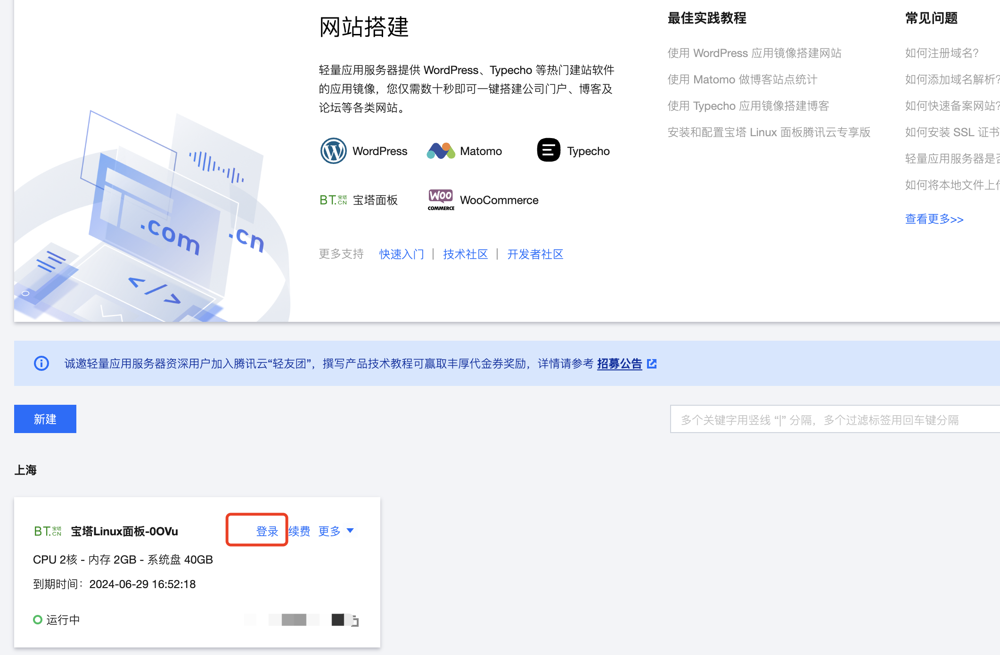
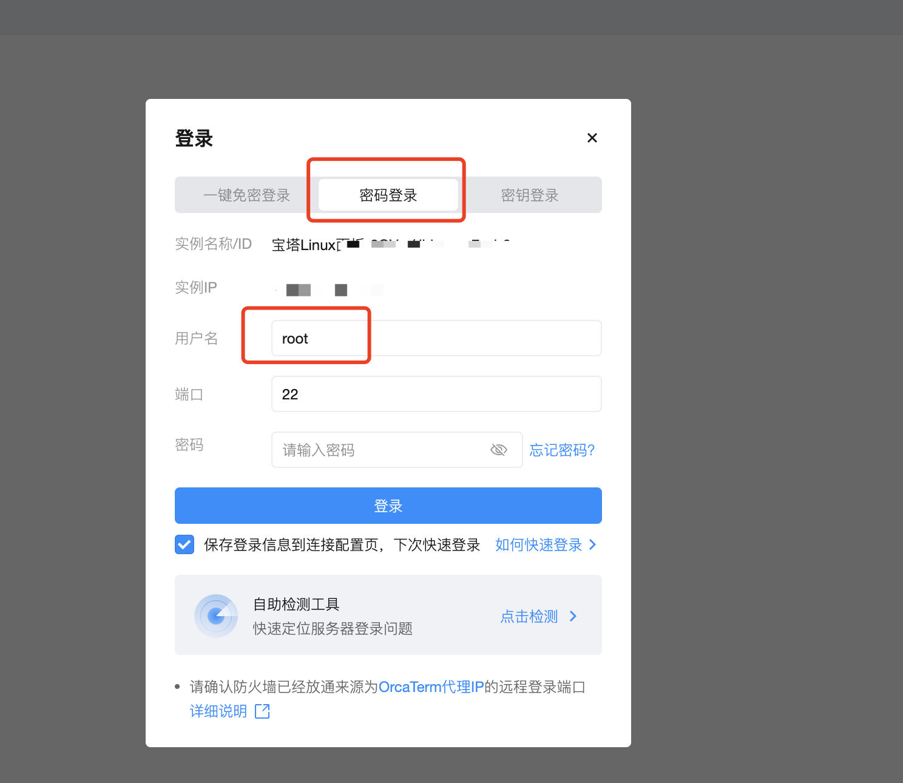
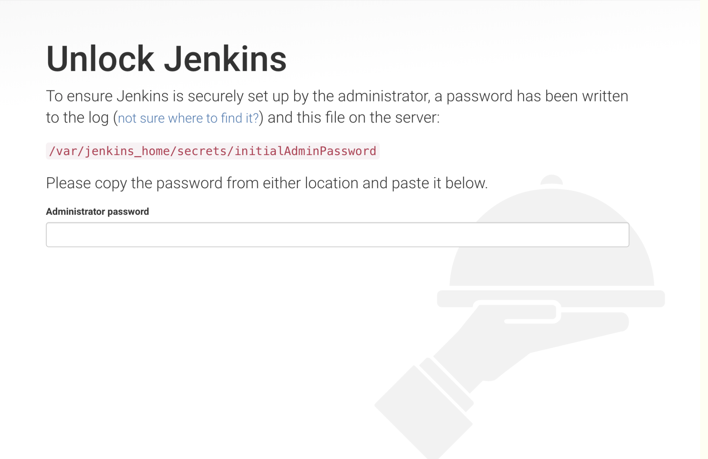
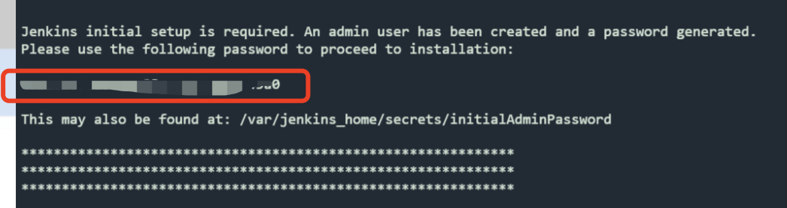
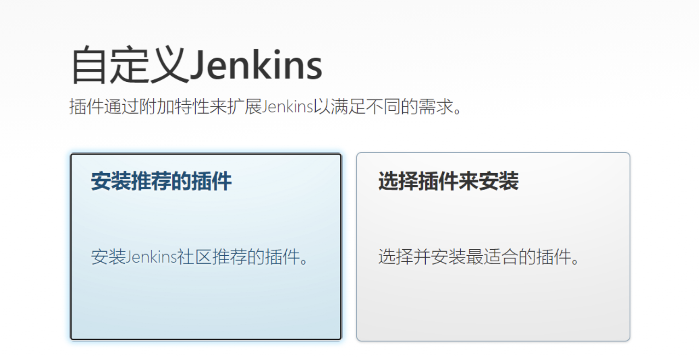
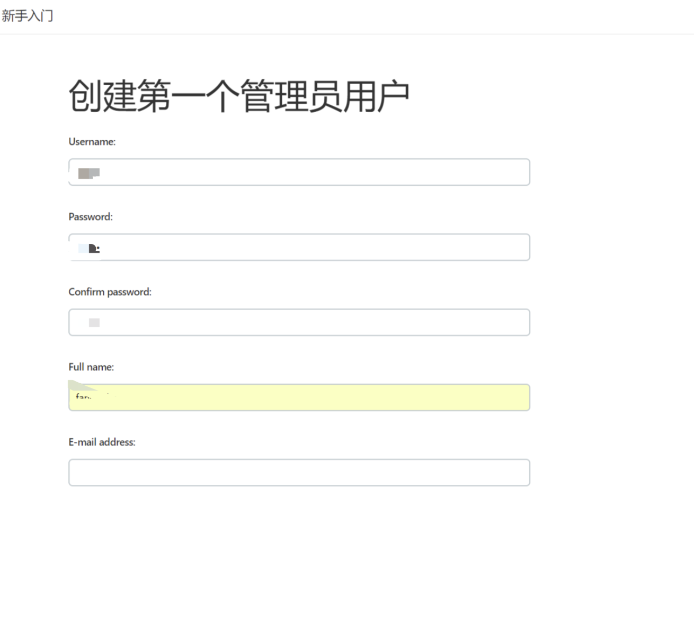
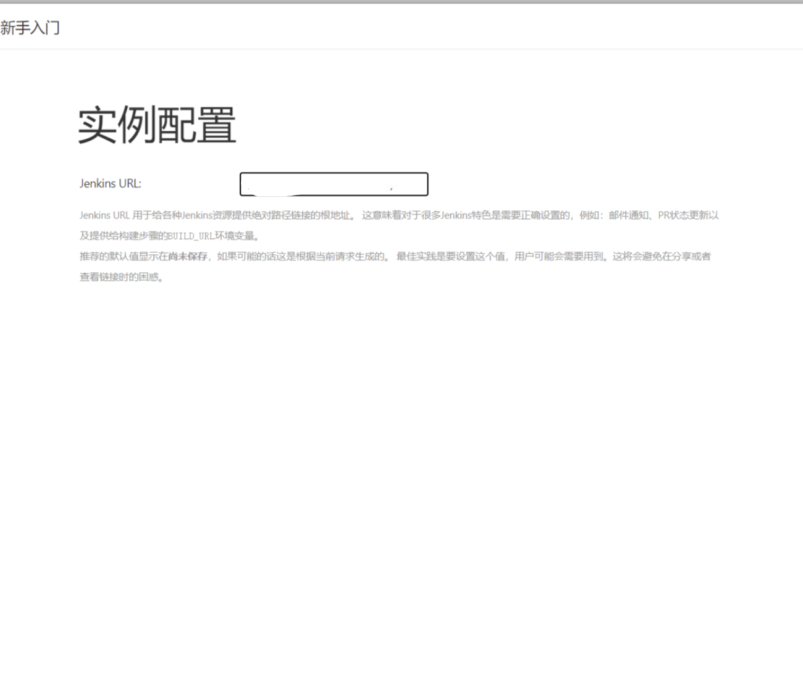

# Docker安装Jenkins 


## Docker安装
::: tip 第一步
以腾讯云服务器为例 打开腾讯云服务器后台 点击"登录"
:::




::: tip 第二步
然后选密码登录以root的方式进行登录，后面需要安装Docker等，不用root可能没有权限。
:::



::: tip 第三步
安装Docker
:::
```
// 更新yum
yum update
yum install epel-release -y
yum clean all
yum list

// 安装docker
yum install docker-io -y

// 启动docker
systemctl start docker

// 验证是否成功
docker version
```

## Jenkins安装

```
// 安装并启动jenkins
docker run -d -p 8080:8080 -p 50000:50000 -v /var/jenkins_mount:/var/jenkins_home -v /etc/localtime:/etc/localtime --name myjenkins jenkins/jenkins
```
::: tip 参数说明
```
-d 后台运行镜像 
-p  8080:8080 将镜像的8080端口映射到服务器的8080端口
-p  50000:50000  将镜像的50000端口映射到服务器的50000端口
-v  /var/jenkins_mount:/var/jenkins_home     
/var/jenkins_home目录为容器Jenkins的工作目录，我们将硬盘上的一个目录挂载到这个位置，
方便后续更新镜像后使用原来的工作目录。这里我们设置的就是上面创建的/var/jenkins_mount目录
-v   /etc/localtime:/etc/localtime  让容器使用和服务器同样的时间设置
--name   myjenkins  给容器起一个别名
```
:::

::: warning 
输入之后会终端会返回一串字符串，记住这串字符串，后续会用到
:::


## 配置Jenkins
打开`http://${你的服务器IP}:8080`，出现让你解锁jenkins界面，



::: tip 激活jenkins
```
docker logs container-id  //container-id就是刚才的字符串
```
:::
::: tip 寻找密码并填写
```
如下图找到这一段，然后填写。
```
:::





::: tip 输入ip地址
```
 输入地址：`http://${你的服务器IP}:8080`
```
:::

然后保存成功。