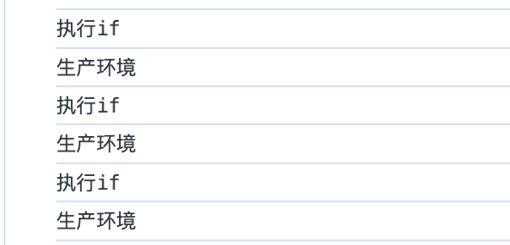
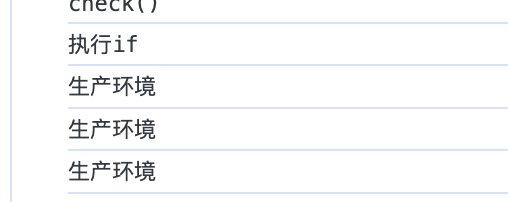

# 前端柯里化

## 什么是前端柯里化
>*柯里化（Currying）是一种在数学和计算机科学中使用的技术，它将一个带有多个参数的函数转换为一系列使用一个参数的函数。* -- 来源于OpenAI。

举个例子:

```js
// 3个数相加
const add = function (a, b, c) {
  return a + b + c;
}
```

我们可以将它转成这样:

```js
const addCurry = function(a) {
  return function(b, c) {
    return a + b + c;
  }
}
```
此时，我们就相当于把`add`函数3个入参拆分: 

```js
add(1,2,3); // 6

addCurry(1)(2,3);

// 我们也可以这样
const add1 = addCurry(1);
add1(2,3); // 6
```

当然我们还可以这样拆分

```js
const addCurry = function(a) {
  return function(b) {
    return function(c) {
      return a + b + c;
    }
  }
}
const add1 = addCurry(1);
const add2 = add1(2);
add2(3); // 6

```

这个过程我们把一个多参数的`add`函数拆分成接收部分入参的其他函数`add1`，并返回一个函数`add2`，该函数又用来接收其他参数。然后该函数又可以重复之前的操作，也就是柯里化。


```js
function fn(a, b, c) {
  return a + b + c
}
function curry(fn) {
  // 取出curry时的参数
  const preParams = [].slice.call(arguments, 1);
  return function () {
    // 取出新函数的参数
    const currentParams = [].slice.call(arguments)
    // 合并参数
    const allParams = [...preParams, ...currentParams]
    // 判断合并参数个数是否大于fn参数
    if (allParams.length >= fn.length) {

      // 大于 则执行fn
      return fn.apply(this, allParams)
    } else {
      // 小于 则继续curry
      return curry.call(null,fn,...allParams);
    }
  }
}

var curried = curry(fn);
curried(1, 2, 3); // 6
curried(1, 2)(3); // 6
curried(1)(2, 3); // 6
curried(1)(2)(3); // 6
curried(7)(8)(9); // 24

```

## 柯里化优点
### 参数复用
```js
// 我们在代码里基本会用到验证输入
const check = (regrex, value) => {
  return regrex?.test(value) || false
}


// 然后我们验证数字时会这么写:
var phoneInput = 123123
check(/^\d*$/, phoneInput)
// 在另一个界面又会写
var phoneInput2 = 123123 
check(/^\d*$/, phoneInput2)

//此时我们可以封装判断是否是数字的函数, 此时我们使用上面的curry函数
const checkIsNumber = curry(check,/^\d*$/);

checkIsNumber(123) //true
checkIsNumber('') //false
checkIsNumber(444.5) //false

```
### 缓存判断
假设一个场景：我们需要根据当前的前端域名来判断是否是测试环境

```js
const isTestEnv = () => {
  if (window.location.href.includes('-test')) {
    console.log('测试环境')
  } else {
    console.log('生产环境')
  }
}
```
但是我们会发现一个问题，每次都是执行`if`函数;
```js 
var isTestEnv = () => {
  console.log('执行if')
  if (window.location.href.includes('-test')) {
    console.log('测试环境')
  } else {
    console.log('生产环境')
  }
}
isTestEnv()
isTestEnv()
isTestEnv()

```

::: tip 
我们如何能力只判断一次if函数
:::

```js
var isTestEnv = () => {
  console.log('执行if')
  if (window.location.href.includes('-test')) {
    return () => console.log('测试环境')
  } else {
    return () => console.log('生产环境')
  }
}

const check = isTestEnv();
check()
check()
check()
```


这里的例子其实也可以用到环境兼容中。在chrome、firefox中，添加事件监听是`addEventListener`，而在ie中是`attachEvent`,这样我们就能一次判断，多次使用了。

### 延迟计算
这里其实就是`curry`函数，将所有的参数合并到一起判断这些参数的个数是否满足`fn`函数，满足就执行，不满足就继续，所以达到了延迟计算的效果