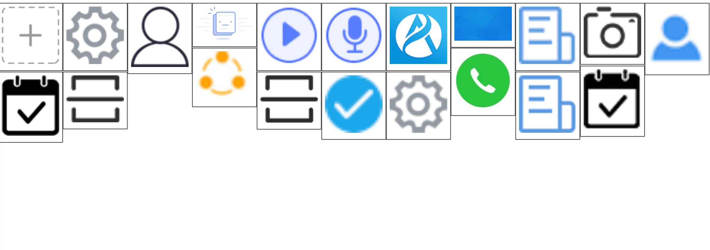

# 瀑布流 - Grid实现

效果图



## 思路
::: tip 第一步
用一个`<div class="container"></div>`作为所有图片的容器。
:::

::: tip 第二步
用一个`<div class="box"></div>`作为每一项
:::

::: tip 第三步
在每个`box`里添加`<div class="box-img"></div>`
:::

::: tip 第四步
在每个`box-img`里添加图片``
:::

::: tip 第五步
grid布局时,每一项宽度可任意设置`grid-template-columns: repeat(auto-fill, 108px);`然后高度我们可以设置10px:`grid-auto-rows: 5px;`所以再设置每一项的grid-row，就可以排列图片。这里的难点就是如何计算每一项高度。我们可以通过img的onload方法，然后通过图片找到它的父元素`box-img`，通过它的offsetHeight / 5就可以计算出`grid-row`。
:::


## 样式
```css

// 设置父元素相对布局
* {
  margin: 0;
  padding: 0;
}

.container {
  display: grid;
  grid-template-columns: repeat(auto-fill, 108px);
  grid-auto-rows: 5px;
  gap: 0;
}

.box-img {
  padding: 5px;
  border: 1px solid #484848;
  box-shadow: 0 0 1px #484848;
}

.box-img img {
  width: 100%;
}
```


## 维护每张图片的位置
```js
  <script>
    const a = document.getElementById('container');
    const boxes = a.children;
    setTimeout(() => {
      for (let index = 0; index < boxes.length; index++) {
        const img = boxes[index].children[0].children[0];
        img.onload = function (e) {
          let span = Math.ceil((e.target.parentElement.offsetHeight / 5));
          boxes[index].style.gridRow = `auto / span ${span}`
        }
      }
    })
  </script>
```


## 源码
[源码](https://github.com/fynmm/projects/blob/main/frontend/index4.html)


